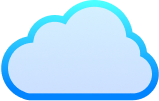

# SaaS Template

This is a [Next.js](https://nextjs.org) project bootstrapped with [`create-next-app`](https://nextjs.org/docs/app/api-reference/cli/create-next-app), based on a Rocketseat event.

## ⭐ Starting

First, install dependencies and run the dev server:

```bash
npm install

# then

npm run dev
```

Generate your `.env.local` file with `AUTH_SECRET`:

```bash
npx auth secret
```

Open [http://localhost:3000](http://localhost:3000) with your browser to see the result.

## ⚙️ Tools

- [Next.js](https://nextjs.org/docs)
- [Auth.js](https://authjs.dev/getting-started/installation)
- [Google OAuth](https://developers.google.com/identity/protocols/oauth2?hl=pt-br)
- [Firebase](https://firebase.google.com/docs/admin/setup?hl=pt-br#add-sdk)

## 📂 Project

```bash
/app
  /(project)
    /page-name
      ..some-component.tsx # Not reusable
      ..page.tsx
    ..page.tsx # Could be the product landing page
  /actions
  /api
    ..route.ts
  /components # For reusable ones
  /hooks
  /lib
  /server
/public
```

## 🛸 Improvements

- [ ] Custom hook: Refactor `createCheckout` function with `payment` or `subscription` params.
